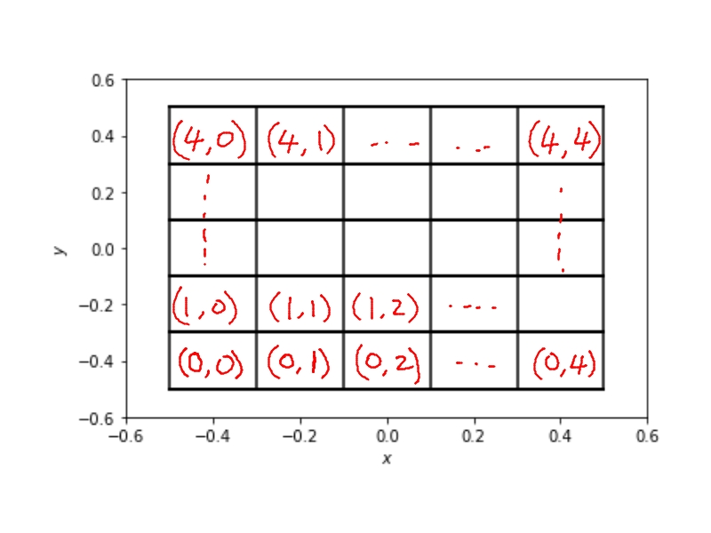
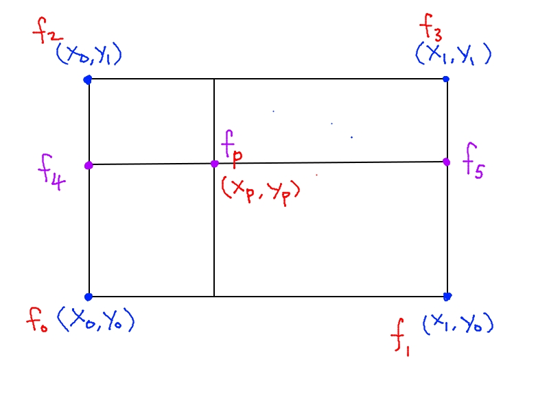

Directed Project 1
===================

Problem Description
----------------------

[Download data file `data.h5`](data.h5)

The downloaded data contains the coordinates (x,y) of a number of
particles. Complete the following steps:

1. Load them into Python and plot them to visualize the particles'
   distribution. Can you say a few things based on your observation?

2. Consider a two-dimensional mesh. The horizontal coordinates (x) are
   `[-0.5, -0.3, -0.1, 0.1, 0.3, 0.5]`. The vertical coordinates (y) are
   `[-0.5, -0.3, -0.1, 0.1, 0.3, 0.5]`. Plot the mesh on top of the
   particle distribution.

3. Develop an indexing system for the mesh cells. The lower left corner cell
   (enclosed by the intervals `[-0.5,-0.3]` in x and `[-0.5, -0.3]` in y) is indexed as
   `(0,0)`. The right upper corner cell (enclosed by `[0.3, 0.5]` in x and `[0.3, 0.5]`
   in y) is index `(4,4)`. See the figure "Distribution of the mesh cells" for an illustration.





4. Write a Python/Numpy code that determines the number of particles
   in each cell. Produce an output like the followings (the numbers in
   the table below are for demonstration only; they are not real
   answers):

```
    Cell index    number of particles

    (0,0)          56
    (0,1)          122
    ...            ...
    (4,4)          79
```

5. Each of the cell corner is associated with a value as a function of its $(x,y)$ coordinates, e.g.

$f(x,y) = -5(x^2 + y^2)$

For example, at the corner $x=0.2, y=0.3$, the value of $f(x,y)$ is $-5 \times (0.2^2 + 0.3^2)$ (by substituting the values of $x$ and $y$ into the formula
above).


6. Use linear interpolation to determine the value of a particle, located at coordinate $(x_p, y_p)$ in the following ways:

    - Use linear interpolation to find $f_4$ using coordinates $(y_0, y_1, y_p)$ and function values $f_0$ at $(x_0,y_0)$ and $f_2$ at $(x_0,y_1)$.
    - Use linear interpolation to find $f_5$ using coordinates $(y_0, y_1, y_p)$ and function values $f_1$ at $(x_1,y_0)$ and $f_3$ at $(x_1,y_1)$.
    - Use linear interpolation to find $f_p$ using coordinates $(x_0, x_1, x_p)$ and function values $f_4$ at $(x_0, y_p)$ and $f_5$ at $(x_1, y_p)$.

See the figure "Linear interpolation stencil" for an illustration.

Write a Numpy function to compute the interpolated values $f_p$ for all particles.





7. Output the data $(x_p, y_p, f_p)$ (i.e. particle positions and its interpolated function value) from step #6 above to a HDF5 file.


Required uploads
----------------------

Upload the following items to the class web site:

1. Your Python code - if you are using Jupyter Notebook/Lab, please export your code into a standard Python code so I can run it directly in a text terminal.

2. Compile all of the outputs (except that of step #7) in a presentation-style format (as if you are presenting the data to your boss).

3. The HDF5 file from step #7.

