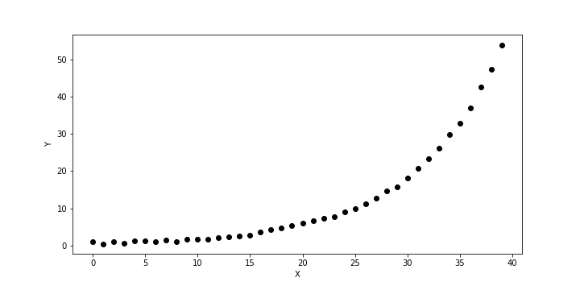

Directed Project 2
========================

Download the data file `expdata.h5`

Load the data $X$ and $Y$ from the data file `expdata.h5` (see the figure below).

Fit the data from `expdata.h5` to an exponential function $f(x) = a \exp (b x)$ such that function $f(x)$ is close to $Y$ at all $X$ points.

Upload the following items to the class web site:

1. Your code. (If you use Jupyter notebook/lab, export your Python code to a file so that I can test/run it directly in a terminal.)

2. The plot containing the function $f(x)$ and $Y$ data points. (They should be close to each other.)

3. What are the values $a$ and $b$ in your curve fit?

